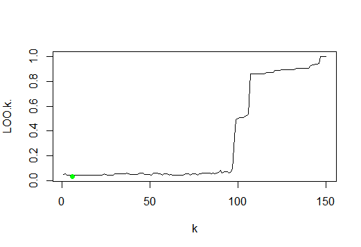
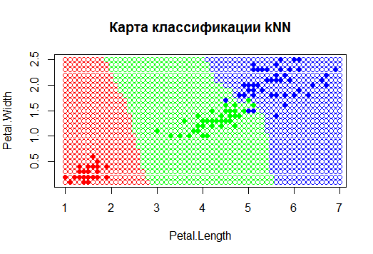

# Алгоритм ближайших соседей (kNN)
<b>Алгоритм kNN</b> - метрический алгоритм классификации, основанный на оценивании сходства объектов. Классифицируемый объект относится к тому классу, которому принадлежат ближайшие к нему объекты обучающей выборки.

## Метод kNN состоит в следующем: 
1. Для классифицируемого объекта вычисляются расстояния от него до каждого объекта обучающей выборки.
2. Обучающая выборка сортируется по возрастанию расстояния от каждого объекта выборки до классифицируемого.
3. Подсчитывается, какой класс доминирует среди k ближайших соседей, и этот класс присваивается классифицируемому объекту.

## Реализация алгоритма на языке R
``` R
kNN <- function(xl, z, k = c(6))
{
  ## Сортируем выборку согласно классифицируемого объекта
  orderedXl <- sortObjectsByDist(xl, z)
  n <- dim(orderedXl)[2] - 1
  ## Получаем классы первых k соседей
  classes <- orderedXl[1:k[length(k)], n + 1]
  
  class <- c(seq(length(k)))
  
  for (i in seq(length(k)))
  {
    ## Составляем таблицу(+считает общее число элементов каждого "типа") встречаемости каждого класса
    counts <- table(orderedXl[1:i,n+1])
    ## Находим класс, который чаще всего встречается среди первых k соседей
    class[i] <- names(which.max(counts))
  }
  
  return (class)
}
```
## Выберем оптимальное k, воспользовавшись критерием скользящего контроля LOO и построим карту классификации kNN
<p></p>
<p></p>
Оптимальное k = 6

# Алгоритм KWNN
При взвешенном способе во внимание принимается не только количество попавших в область определённых классов, но и их удалённость от нового значения. Для каждого класса определяется оценка близости. У какого класса выше значение близости, тот класс и присваивается новому объекту.

<p></p>

``` R
kwNN <- function(xl, z, k, q)
{
  ## Сортируем выборку согласно классифицируемого	объекта
  orderedXl <- sortObjectsByDist(xl, z)
  n <- dim(orderedXl)[2]
  ## Получаем классы первых k соседей
  classes <- orderedXl[1:k, n]
  ## Получаем матрицу с весом каждого ближайшего элемента
  weighted_classes <- cbind(as.matrix(classes),q^as.numeric(1:k))
  
  lvls <- levels(classes)
  ## Суммируем все одинаковые классы и добавляем значения в матрицу
  result <- as.matrix(sapply(1:length(lvls), function(x) sum(as.numeric(weighted_classes[which(weighted_classes[,1] == lvls[x]),2]))))
  
  ## Находим класс, который доминирует среди первых k соседей
  class <- lvls[which.max(result)]	
  return (class)
}
```


## Сравнение качества алгоритмов kNN и kwNN.

kNN — один из простейших алгоритмов классификации, поэтому на реальных задачах он зачастую оказывается неэффективным. Помимо точности классификации, проблемой этого классификатора является скорость классификации: если в обучающей выборке N объектов, в тестовой выборе M объектов, и размерность пространства  K, то количество операций для классификации тестовой выборки может быть оценено как O(KMN).

kwNN отличается от kNN, тем что учитывает порядок соседей классифицируемого объекта, улчшая качество классификации.

Пример, показывающий преимущество метода kwNN над kNN:

<p></p>

В примере передаем параметр k=5.  Kwnn в отличии от Knn оценивает не только индекс соседа, но и  расстояние до него, из-за этого результат получается более точный, что и продемонстрировано в данном примере.
