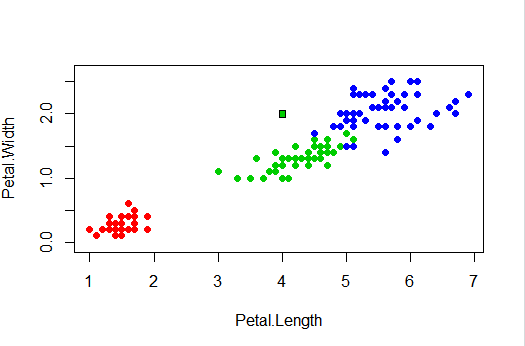
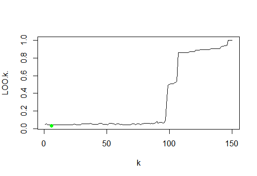
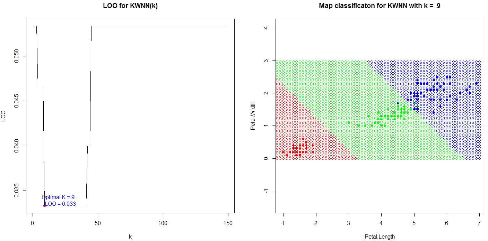
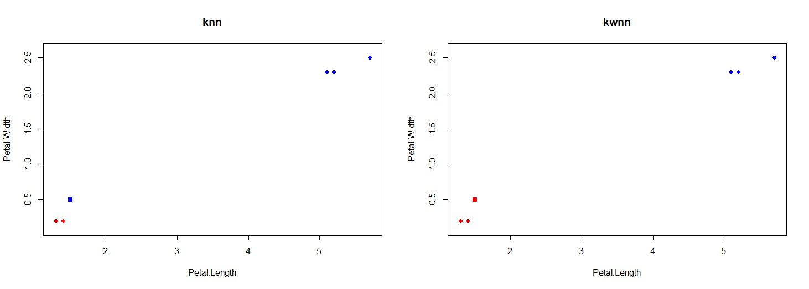

## 1NN 
# Метод 1NN состоит в следующем: 
	1.Для классифицируемого объекта вычисляются расстояния от него до каждого объекта обучающей выборки.
	2.Обучающая выборка сортируется по возрастанию расстояния от каждого объекта выборки до классифицируемого
	3.Классифицируемому объекту присваивается тот же класс, что и ближайшего к нему объекта выборки.
<p></p>

## KNN 
# Метод kNN состоит в следующем: 
	1.Для классифицируемого объекта вычисляются расстояния от него до каждого объекта обучающей выборки
	2.Обучающая выборка сортируется по возрастанию расстояния от каждого объекта выборки до классифицируемого
	3.Подсчитывается, какой класс доминирует среди k ближайших соседей, и этот класс присваивается классифицируемому объекту

## Алгоритм k ближайших соседей (kNN)
Алгоритм 1NN относит классифицируемый объект U к тому классу, которому принадлежит его ближайший сосед.
ὠ(i,u)=[i=1]; Алгоритм kNN относит объект к тому классу, элементов которого больше среди k ближайших соседей x(i), i=1,..,k. Для оценки близости классифицируемого объекта *u* к классу *y* алгоритм kNN использует следующую функцию:
ὠ(i,u)=[i<=k], где *i* -- порядок соседа по расстоянию к классифицируемому объекту *u*, k-количество параметров;

``` R
kNN <- function(xl, z, k = c(6))
{
  ## Сортируем выборку согласно классифицируемого	объекта
  orderedXl <- sortObjectsByDist(xl, z)
  n <- dim(orderedXl)[2] - 1
  ## Получаем классы первых k соседей
  classes <- orderedXl[1:k[length(k)], n + 1]
  
  class <- c(seq(length(k)))
  
  for (i in seq(length(k)))
  {
    ## Составляем таблицу(+считает общее число элементов каждого "типа") встречаемости каждого класса
    counts <- table(orderedXl[1:i,n+1])
    ## Находим класс, который чаще всего встречается среди первых k соседей
    class[i] <- names(which.max(counts))
  }
  
  return (class)
}
```
<p></p>


## KWNN
Реализаця метода kwNN
В каждом классе выбирается
__k__ ближайших к __U__ объектов, и объект u относится к тому классу, для
которого среднее расстояние до __k__ ближайших соседей минимально.

где,
 — строго убывающая последовательность вещественных весов, задающая
вклад i-го соседа при классификации объекта u.

<p></p>

``` R
kwNN <- function(xl, z, k, q)
{
  ## Сортируем выборку согласно классифицируемого	объекта
  orderedXl <- sortObjectsByDist(xl, z)
  n <- dim(orderedXl)[2]
  ## Получаем классы первых k соседей
  classes <- orderedXl[1:k, n]
  ## Получаем матрицу с весом каждого ближайшего элемента
  weighted_classes <- cbind(as.matrix(classes),q^as.numeric(1:k))
  
  lvls <- levels(classes)
  ## Суммируем все одинаковые классы и добавляем значения в матрицу
  result <- as.matrix(sapply(1:length(lvls), function(x) sum(as.numeric(weighted_classes[which(weighted_classes[,1] == lvls[x]),2]))))
  
  ## Находим класс, который доминирует среди первых k соседей
  class <- lvls[which.max(result)]	
  return (class)
}
```


#### Сравнение качества алгоритмов kNN и kwNN.

kNN — один из простейших алгоритмов классификации, поэтому на реальных задачах он зачастую оказывается неэффективным. Помимо точности классификации, проблемой этого классификатора является скорость классификации: если в обучающей выборке N объектов, в тестовой выборе M объектов, и размерность пространства  K, то количество операций для классификации тестовой выборки может быть оценено как O(KMN).

kwNN отличается от kNN, тем что учитывает порядок соседей классифицируемого объекта, улчшая качество классификации.

Пример, показывающий преимущество метода kwNN над kNN:

<p></p>

В примере передаем параметр k=5.  Kwnn в отличии от Knn оценивает не только индекс соседа, но и  расстояние до него, из-за этого результат получается более точный, что и продемонстрировано в данном примере.

Число k выбирается методом LOO (скользящего контроля)


### Метод LOO:
1. Элемент удаляется из выборки
2. Запускается алгоритм классификации (в данном случае kNN) для полученной выборки и удалённого объекта
3. Полученный класс объекта сравнивается с реальным. В случае несовпадения классов, величина ошибки увеличивается на 1
4. Процесс повторяется для каждого объекта выборки
5. Полученная ошибка усредняется
6. Процесс повторяется для других значений k. В итоге выбирается число k с наименьшей ошибкой LOO
    

```	R
##Составляем таблицу встречаемости каждого класса
counts <- table(classes)
class <- names(which.max(counts))
return (class)
}

## Метод скользящего контроля
Loo <- function(k,xl)
   {
    sum =0
    for(i in 1:dim(xl)[1]
       {
        tmpXL <- rbind(xl[1:i-1, ],
        xl[i+1:dim(xl)[1],])
        xi <- c(xl[i,1], xl[i,2])
        class <-kNN(tmpXL,xi,k)
        if(class != xl[i,3])
        sum=sum+1
       }
   sum=sum/dim(xl)[1]
   return(sum)
  }
```

 ### Преимущества:
 Преимущество LOO состоит в том, что каждый объект ровно один раз участвует в контроле, а длина обучающих подвыборок лишь на единицу меньше длины полной выборки.
 ### Недостатки:
  Недостатком LOO является большая ресурсоёмкость, так как обучаться приходится L раз. Некоторые методы обучения позволяют достаточно быстро перенастраивать внутренние параметры алгоритма при замене одного обучающего объекта другим. В этих случаях вычисление LOO удаётся заметно ускорить. 