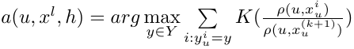
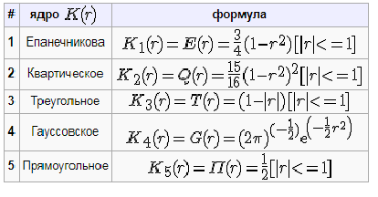
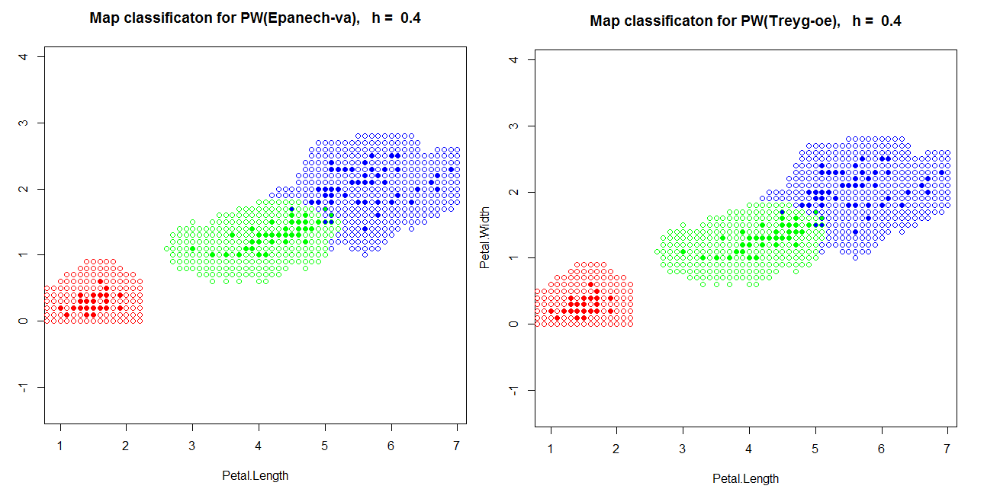
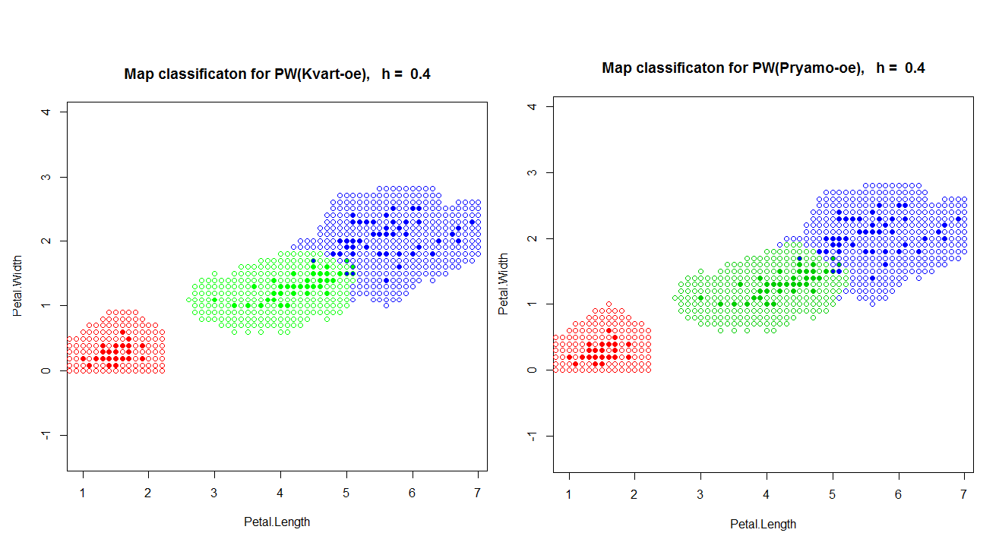
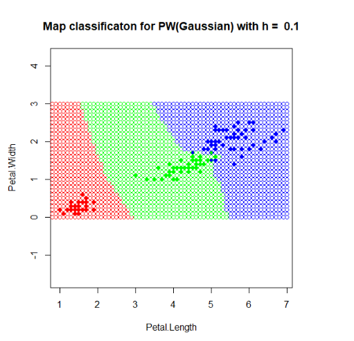
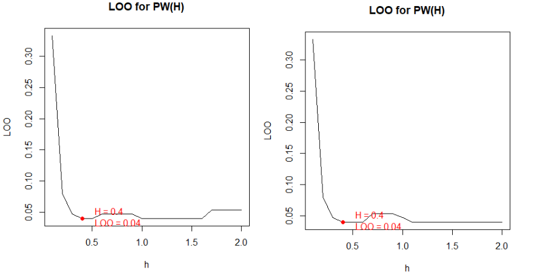
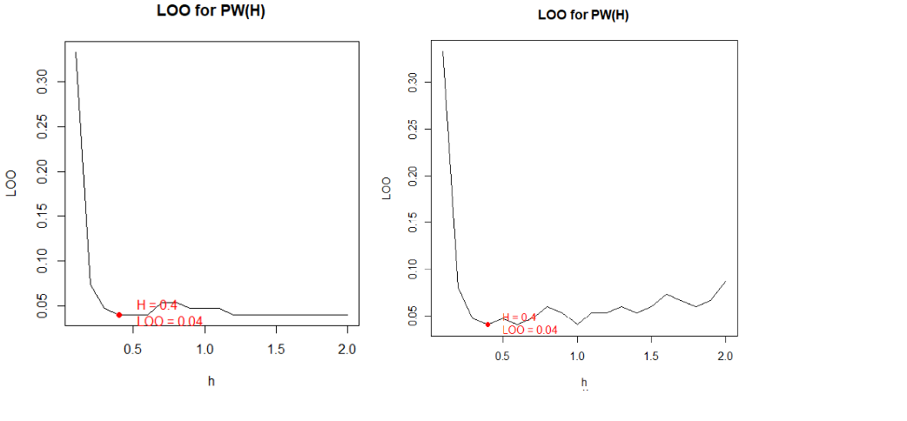
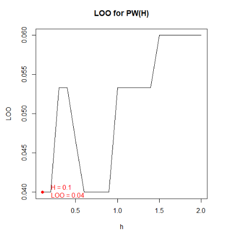

# Метод Парзеновского окна
**Метод Парзеновского окна** - метрический алгоритм классификации, основанный на оценивании сходства объектов. Классифицируемый объект относится к тому классу, которому принадлежат ближайшие к нему объекты обучающей выборки. При чем, объекты учитываются не по рангу, как в kNN и kwNN, а по расстоянию. 

### Формула Парзеновского окна выглядит следующим образом:
\
где **K(x)** - невозрастающая на **[0; ∞)** функция ядра,\
а **h** - параметр (ширина окна).\
Если плотность объектов в пространстве неоднородна, то имеет смысл использовать переменную ширину окна, тогда формула приобретает следующий вид:\


Наиболее часто используются следующие типы ядер:\


Алгоритм вокруг нашей классифицируемой точки u строит окружность с радиусом h. Далее убираем точки, которые не вошли в окружность. Затем для оставшихся, считаем weights, суммируем по class, и с помощью names(which.max(weights)) возвращаем название класса "победителя".

``` R
PW = function(XL,y,h,metricFunction = euclideanDistance)
{
  l <- dim(xl)[1]

  weights = rep(0,3)
  names(weights) = unique(xl[,3])
  for(i in 1:l)
  {
    
    x=XL[i,1:2]
    class=XL[i,3]
    
    r = metricFunction(x,y)/h
    weights[class]=kernelR(r)+weights[class];
  }

  #no p in w
  if(max(weights)==0) 
  {
    return ("0")
  }
  else
  {
    return (names(which.max(weights)))
  }
}
```

## Карта классификации для ядра Епанечникова и для Треугольного ядра

<p></p>

## Карта классификации для Квартического ядра и для Прямоугольного ядра

<p></p>

## Карта классификации для Гауссовского ядра

В отличии от предыдущих ядер, Гауссовское ядро устраняет проблему с классификацией точек, не попавших ни в одно окно.

<p></p>


## Loo для ядра Епанечникова и для Треугольного ядра

<p></p>

## Loo для Квартического ядра и для Прямоугольного ядра

<p></p>

## Loo для Гауссовского ядра

<p></p>

__Плюсы:__
- прост в реализации
- хорошее качество классификации при правильно подобраном _h_
- все точки с одинаковым расстоянием будут учитаны

__Минусы:__
- необходимо хранить всю выборку целиком
- небольшой набор параметров
- диапазон параметра _h_ необходимо подбирать самостоятельно(в зависимости от плотности расположения т.)
- если ни одна точка не попала в радиус _h_, алгоритм не способен ее
классифицировать (кроме гауссовского ядра)