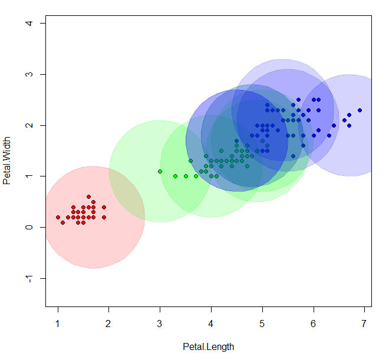

# Потенциальные функции (PF)

__Метод потенциальных функций__ - относится к метрическим классификаторам. В отличии от метода парзеновсуих окон, окно строится вокруг обучающих точек.
При классификации объект проверяется на близость к объектам из обучающей выборки. Простыми словами, объекты из обучающей выборки «заряжены» своим классом, а вес каждого из них при классификации зависит от «заряда» и расстояния до классифицируемого объекта.

__Алгоритм метода PF__

   - Изначально для каждого объекта выборки задаём *ширину окна*  эмпирически (выбирается из собственных соображений).
   - Затем для обучающих объектов вычисляем *силу потенциала* . 
   - После чего каждому объекту выборки присваивается *вес* по формуле ,  - функция ядра.
   - Суммируем веса объектов одинаковых классов. Класс "победитель" присваивается точке.

    
 __Код метода потенциальных функций:__
 
      PF = function(potentials,XL,y,h,metricFunction = euclideanDistance)
    {
     l <- nrow(XL)
     n <- ncol(XL)

     weights = rep(0,3)
    names(weights) = unique(XL[,3])
     for(i in 1:l)
    {
    
    x=XL[i,1:2]
    class=XL[i,3]
    
    r = metricFunction(x,y)/h
    weights[class] = weights[class] + potentials[i]*kernelR(r);
    }
    class = names(which.max(weights))
       #no p in w
    if (max(weights) == 0) return("0") 
      return(class)
         }
	 
Алгоритм подбора :

   - Множество потенциалов  зануляется. Задается максимально допустимое число ошибок(eps).
   - Из обучающей выборки выбирается очередной объект .
   - Затем Для  запускаю алгоритм классификации.
   - Если  полученный класс не совпал с реальным, то *сила потенциала* для выбранного объекта увеличивается на 1. Иначе снова выбирается объект и классифицируется.
   - Алгоритм классификации с полученными значениями потенциалов запускается для каждого объекта выборки. Подсчитывается число ошибок.
   - Если число ошибок меньше заданного, то алгоритм завершает работу. Иначе снова выбирается объект из выборки.
	 
__Код алгоритма подбора :__

     getPotentials <- function(XL,eps,h,class) 
    {
     # get pots all elements
    l <- nrow(XL)
     n <- ncol(XL)

    potentials <- rep(0,l)
    err <- eps + 1
 
    while (err > eps) 
    {
     while (TRUE) 
     {
      # Пока не получим несоответствие классов, чтобы обновить потенциалы
      rand <- sample(1:l, 1)
     x=XL[rand,1:2]
        u <- PF(potentials,XL,x,h)

      if(colors[u] != colors[class[rand]]) {
        potentials[rand] = potentials[rand] + 1
        break
        }
     }
    # Подсчет числа ошибок
    err <- 0
    for (i in 1:l)
    {
      x = XL[i,1:2]
        points=XL[-i,1:3]
         if(colors[PF(potentials,points,x,h)]!= colors[class[i]])
     {
          err = err + 1
    }
    }
    }
     return (potentials)
    }
    
В данной программе использовал прямоугольное ядро. Алгоритм подбирает только силу потенциала , радиус потенциалов h задаются эмпирически(по собственным соображениям).

Список ненулевых потенциалов(15 номеров)

     [1] 3
     [1] 66
     [1] 71
     [1] 78
     [1] 84
     [1] 87
     [1] 94
     [1] 102
     [1] 105
     [1] 107
     [1] 119
     [1] 120
     [1] 122
     [1] 134
     [1] 139

__Задать значение ширины окна для каждого класса__
  
     SvoiH <- function(xl) 
     {
     l <- nrow(xl)
     h <- rep(0, l)
     for(i in 1:l) {
     if (xl[i, ncol(xl)] == "setosa") h[i] <- 1
     else h[i] <- 0.4
                  }
     return (h)
      }
      h <- SvoiH(xl)
      
Подбор потенциалов происходит до тех пор, пока точность алгоритма, не будет меньше заданной ошибки eps.
Иллюстрация результата работы алгоритма:

__Преимущества метода потенциальных функций:__

- Большое количество параметров для подбора. 
- Возможность использования не всей выборки

__Недостатки метода:__

- Метод непрост для понимания и алгоритмической реализации;
- Неопределённое время работы алгоритма подбора(если взять маленькое eps) ;
- Параметры . и _h_ настраиваются слишком грубо;