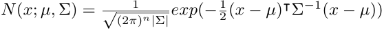
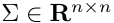
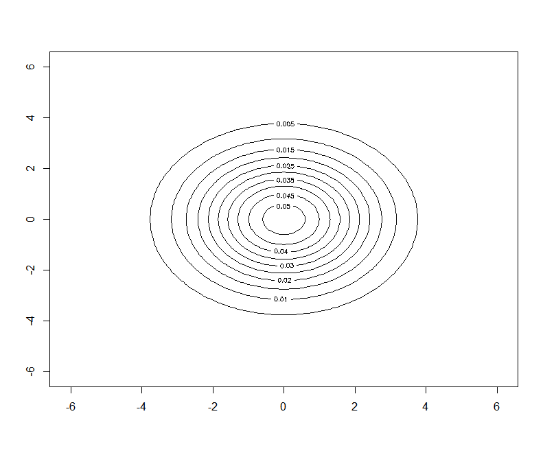
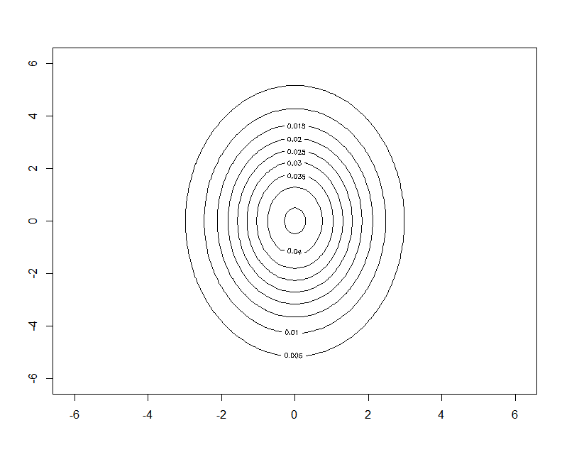
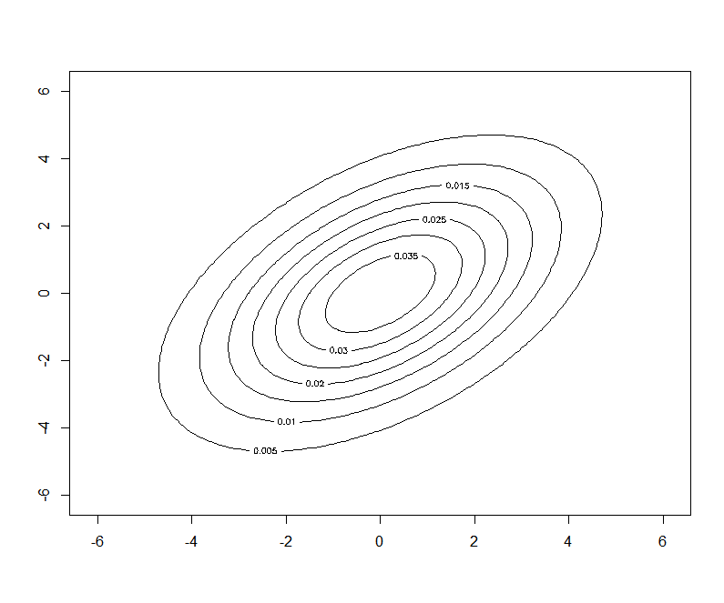

# Линии уровня нормального распределения
### Вероятностное распределение с плотностью
\
называется n-мерным многомерным нормальном распределением\
с математическим ожиданием (центром) ,\
и ковариационной матрицей 

## Геометрия нормальной плотности
1. Признаки имеют одинаковую дисперсию => линия уровня плотности распределения имеет форму круга.
2. Признаки некоррелированны => линия уровня плотности распределения имеет форму эллипсоида.
3. Признаки коррелированы => линия уровня плотности распределения имеет форму эллипсоида и оси повернуты относительно системы координат.

## Одинаковая дисперсия


## Признаки некоррелированы


## Признаки коррелированы


## Реализация на R
```r
drawLines <- function(center, cv) {
  det <- det(cv)
  a <- cv[2, 2] / det
  b <- -cv[1, 2] / det
  c <- -cv[2, 1] / det
  d <- cv[1, 1] / det
  
  x0 <- center[1]
  y0 <- center[2]
  
  A <- d
  B <- a
  C <- -c -b
  D <- -2*d*x0 + y0*(c+b)
  E <- -2*a*y0 + x0*(c+b)
  F <- d*x0^2 + a*y0^2 + x0*y0*(-c-b)
  
  func <- function(x, y) {
    1 / (2*pi*sqrt(det)) * exp(-0.5 * (x^2*A + y^2*B + x*y*C + x*D + y*E + F))
  }
  
  X <- seq(-6-0.1, 6+0.1, 0.1)
  Y <- seq(-6-0.1, 6+0.1, 0.1)
  Z <- outer(X, Y, func)
  
  contour(X, Y, Z)
}

par(pty="m")

#drawLines(c(0, 0), matrix(c(3, 0, 0, 3), 2, 2))
drawLines(c(0, 0), matrix(c(6, 0, 0, 2), 2, 2))
#drawLines(c(0, 0), matrix(c(4, -4, 0, 4), 2, 2))
```