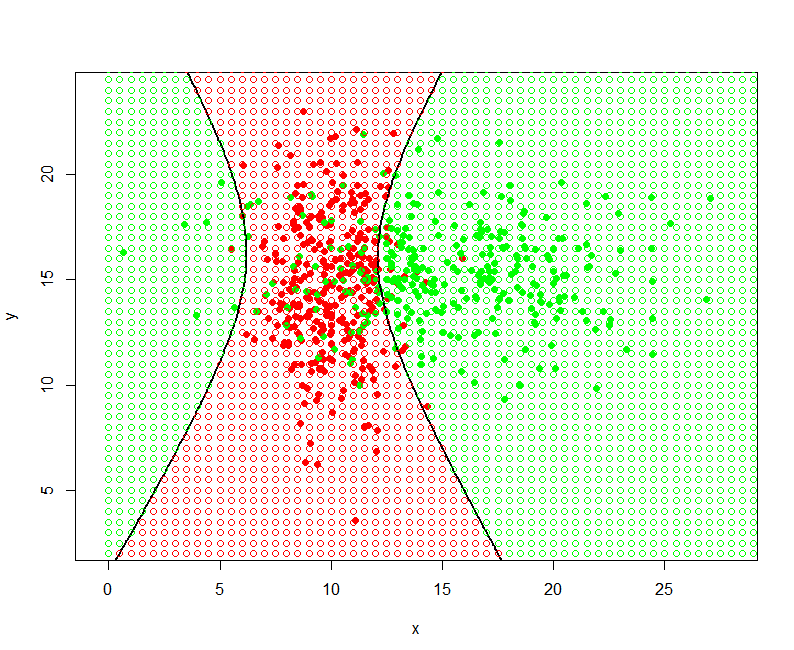
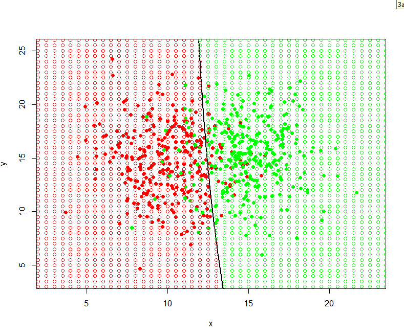

# Подстановочный алгоритм (plug-in)

Суть алгоритма заключается в восстановлении параметров нормального распределения **μ<sub>y</sub>**, **Σ<sub>y</sub>** для каждого класса **y** и подстановке их в формулу оптимального байесовского классификатора.

Оценка параметров нормального распределения производится на основе принципа максимума правдоподобия:
\


Уравнение разделяющей поверхности - кривая
второго порядка.

## Результат
В зависимости от параметров классов разделяющая поверхность может принимать различные формы.

## Гипербола


## Эллипс


## Прямая


## Реализация на R
``` R
library("MASS")

estimateMu <- function(xs) {
  l <- dim(xs)[2]
  res <- matrix(NA, 1, l)
  for (i in seq(l)) {
    res[1, i] <- mean(xs[,i])
  }
  return(res)
}

estimateSigma <- function(xs, mu) {
  rows <- dim(xs)[1]
  cols <- dim(xs)[2]
  
  res <- matrix(0, cols, cols)
  for (i in seq(rows)) {
    res <- res + t(xs[i,] - mu) %*% (xs[i,] - mu)
  }
  
  return(res/(rows - 1))
}

getFunc <- function(sigma1, mu1, sigma2, mu2) {
  d1 <- det(sigma1)
  d2 <- det(sigma2)
  invs1 <- solve(sigma1)
  invs2 <- solve(sigma2)
  
  a <- invs1 - invs2
  b <- invs1 %*% t(mu1) - invs2 %*% t(mu2)
  
  A <- a[1,1] # x^2
  B <- a[2,2] # y^2
  C <- 2 * a[1, 2] # xy
  D <- -2 * b[1, 1] # x
  E <- -2 * b[2, 1] # y
  G <- c(mu1 %*% invs1 %*% t(mu1) - mu2 %*% invs2 %*% t(mu2)) + log(abs(det(sigma1))) - log(abs(det(sigma2)))
  
  func <- function(x, y) {
    x^2 * A + y^2 * B + x*y*C + x*D + y*E + G
  }
  
  return(func)
}

classificator <- function(x, mu1, mu2, sigma, sigma2, Prob, Prior) {
  res <- log(Prob * Prior)
  l <- length(x)
  chisl1 <- exp(
    (-1/2)*(
      t(x-as.vector(mu1)) %*% solve(sigma1) %*% (x-as.vector(mu1))
    )
  )
  chisl2 <- exp(
    (-1/2)*(
      t(x-as.vector(mu2)) %*% solve(sigma2) %*% (x-as.vector(mu2))
    )
  )
  
  
  res1 = chisl1/((2*pi) * det(sigma1)^(1/2))
  res2 = chisl2/((2*pi) * det(sigma2)^(1/2))
  
  #
  color <- ifelse(res1 > res2, "red", "green")
  #
  
  return(color)
}

n <- 300
colors <- c("red", "green")

# ковариационные матрицы для которой разделяющая поверхность - гиперполоид
sigma1 <- matrix(c(3, 0, 0, 10), 2, 2)
sigma2 <- matrix(c(20, 0, 0, 5), 2, 2)

# ковариационные матрицы для которой разделяющая поверхность - элипсоид
#sigma1 <- matrix(c(10, 0, 0, 1), 2, 2)
#sigma2 <- matrix(c(30, 0, 0, 10), 2, 2)

# ковариационные матрицы для которой разделяющая поверхность - линейная
#sigma1 <- matrix(c(5, 0, 0, 10), 2, 2)
#sigma2 <- matrix(c(5, 0, 0, 10), 2, 2)

mu1 <- c(10, 15)
mu2 <- c(15, 15)

xc1 <- mvrnorm(n=n, mu = mu1, Sigma = sigma1)
xc2 <- mvrnorm(n=n, mu = mu2, Sigma = sigma2)

plotxmin <- min(xc1[,1], xc2[,1]) - 1
plotymin <- min(xc1[,2], xc2[,2]) - 1
plotxmax <- max(xc1[,1], xc2[,1]) + 1
plotymax <- max(xc1[,2], xc2[,2]) + 1

# система
plot(c(), type="n", xlab = "x", ylab = "y", xlim=c(plotxmin, plotxmax), ylim = c(plotymin, plotymax))

# объекты
points(xc1, pch=21, col=colors[1], bg=colors[1])
points(xc2, pch=21, col=colors[2], bg=colors[2])
scalex <- 40
scaley <- 40

mu1 <- estimateMu(xc1)
mu2 <- estimateMu(xc2)
sigma1 <- estimateSigma(xc1, mu1)
sigma2 <- estimateSigma(xc2, mu2)

func <- getFunc(sigma1, mu1, sigma2, mu2)

x <- seq(plotxmin-5, plotxmax+5, len = 150)
y <- seq(plotymin-5, plotymax+5, len = 150)
z <- outer(x, y, func)
contour(x, y, z, levels = 0, add = TRUE, drawlabels = TRUE, lwd = 2.5)

# карта
x <- seq(0, 40, 40/80)
y <- seq(0, 40, 40/80)

for (i in x) {
  for (j in y) {
    color <- classificator(c(i, j), mu1, mu2, sigma1, sigma2, 1, 1)
    
    points(i, j, pch = 21, col = color)
  }
}
```